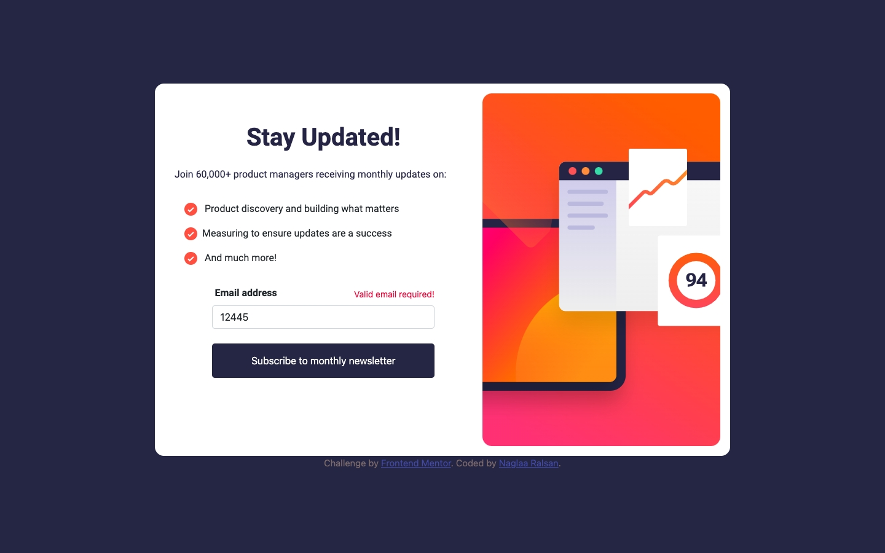
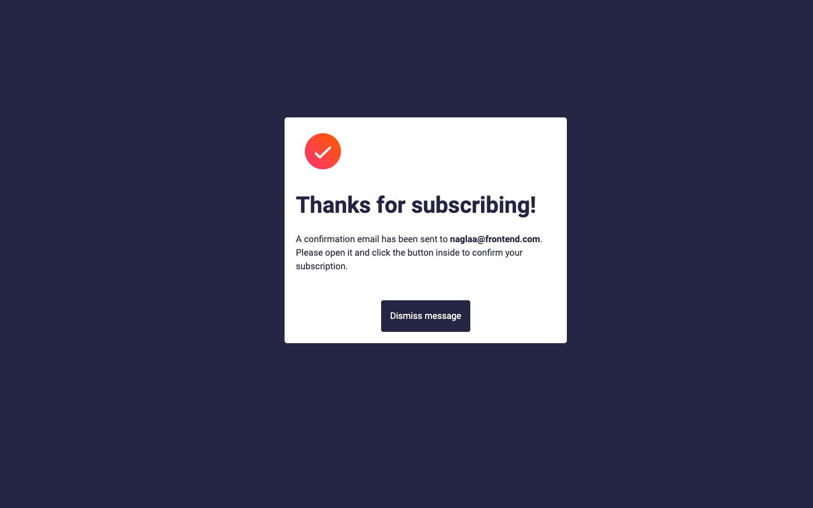
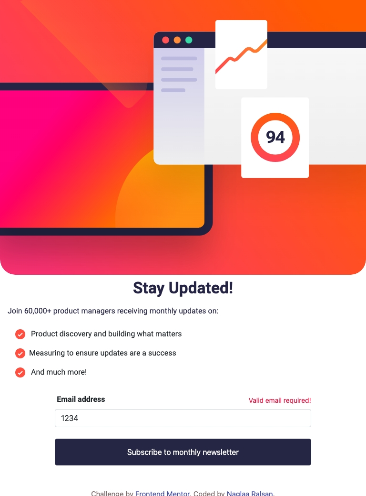
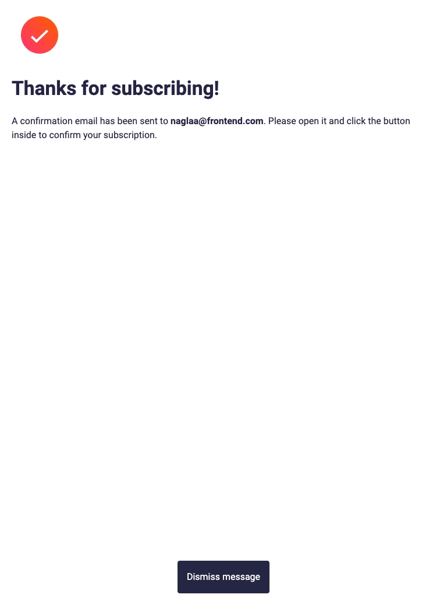
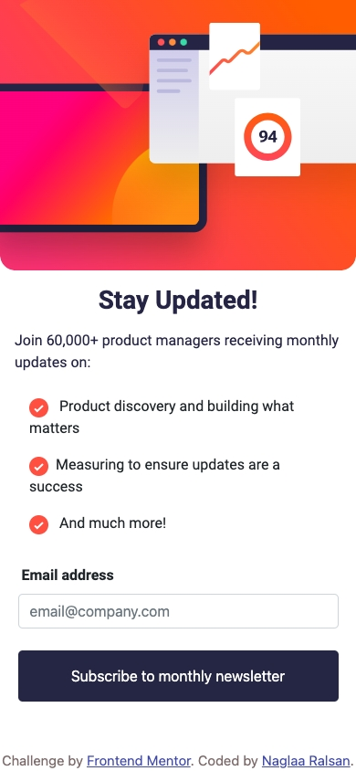
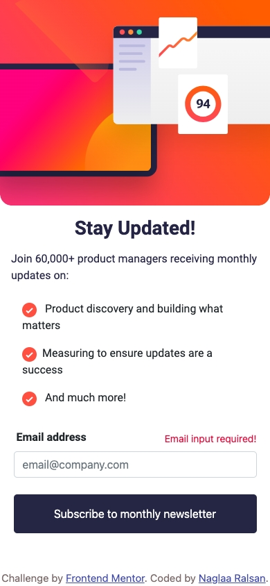
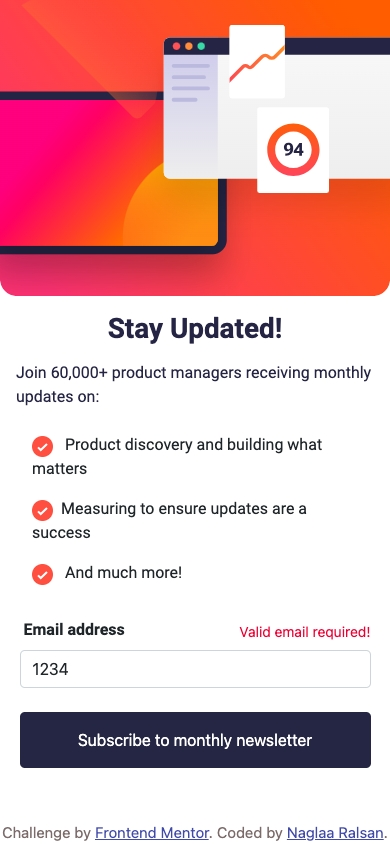
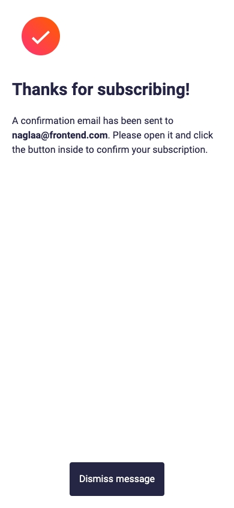

# Frontend Mentor - Newsletter sign-up form with success message solution

This is a solution to the [Newsletter sign-up form with success message challenge on Frontend Mentor](https://www.frontendmentor.io/challenges/newsletter-signup-form-with-success-message-3FC1AZbNrv). Frontend Mentor challenges help you improve your coding skills by building realistic projects. 

## Table of contents

- [Overview](#overview)
  - [The challenge](#the-challenge)
  - [Screenshot](#screenshot)
  - [Links](#links)
- [My process](#my-process)
  - [Built with](#built-with)
  - [What I learned](#what-i-learned)
  - [Continued development](#continued-development)
  
- [Author](#author)

**Note: Delete this note and update the table of contents based on what sections you keep.**

## Overview

### The challenge

Users should be able to:

- Add their email and submit the form
- See a success message with their email after successfully submitting the form
- See form validation messages if:
  - The field is left empty
  - The email address is not formatted correctly
- View the optimal layout for the interface depending on their device's screen size
- See hover and focus states for all interactive elements on the page

### Screenshot
 - Desktop : ,
 ,
 ,
 

 - Ipad : ,
 ,
 ,
 
 

- Mobile : ,
,
,

**Note: Delete this note and the paragraphs above when you add your screenshot. If you prefer not to add a screenshot, feel free to remove this entire section.**

### Links

- Solution URL: [Solutoion Repository](https://github.com/codeAndcocoa/-Newsletter-sign-up-form-with-success-message.git)
- Live Site URL: [Live site link](https://your-live-site-url.com)

## My process

### Built with

- Semantic HTML5 markup
- CSS custom properties
- Flexbox
- CSS Grid
- Mobile-first workflow
- vanilla JavaScript
- Bootstrap 5

**Note: These are just examples. Delete this note and replace the list above with your own choices**

### What I learned

- The main thing that I learned is how to build a project using bootstrap.

### Continued development

Use this section to outline areas that you want to continue focusing on in future projects. These could be concepts you're still not completely comfortable with or techniques you found useful that you want to refine and perfect.

**Note: Delete this note and the content within this section and replace with your own plans for continued development.**

## Author

- Website - [Github profile](https://github.com/codeAndcocoa)
- Frontend Mentor - [@codeAndcocoa](https://www.frontendmentor.io/profile/codeAndcocoa)

**Note: Delete this note and add/remove/edit lines above based on what links you'd like to share.**

